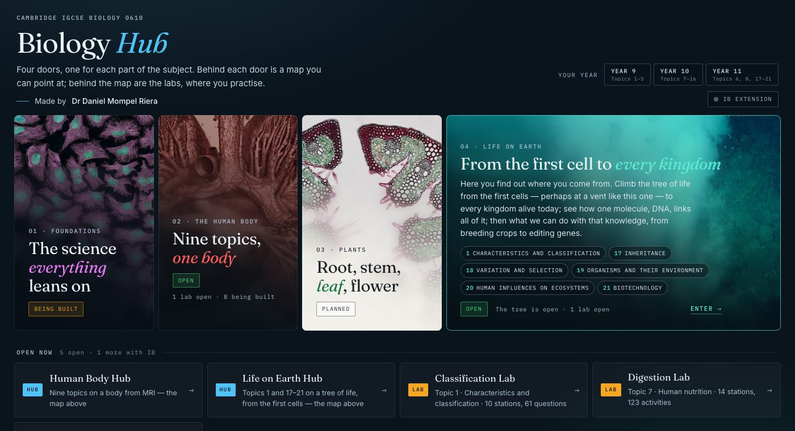

<div align="center">

<h1>🧬 &nbsp;Biology Hub</h1>

**Free interactive revision for Cambridge IGCSE Biology 0610 — for any school, anywhere.**

Four doors, one for each part of the subject. Behind each is a map students point at; behind the
map are the labs, where they practise and the questions mark themselves.

[](https://nlcsbiology.com/igcse-biology-hub/)


by **Dr Daniel Mompel Riera**

</div>



---

## For your students — there is nothing to set up

Send them the link and you are done: **<https://nlcsbiology.com/igcse-biology-hub/>**

No account, no sign-up, no install, nothing to pay. It works on a phone, a Chromebook or a school
PC, and progress is saved in the student's own browser.

| Door | Topics (0610) | Behind it |
|---|---|---|
| **Foundations** | 2 · 3 · 4 · 5 | being built |
| **The human body** | 7 · 9–16 | [Human Body Hub](https://nlcsbiology.com/human-body-hub/) 🟢 · [Digestion Lab](https://nlcsbiology.com/digestion-lab/) 🟢 |
| **Plants** | 6 · 8 · 16.3 | planned |
| **Life on Earth** | 1 · 17–21 | [Life on Earth Hub](https://nlcsbiology.com/life-on-earth-hub/) 🟢 · [Classification Lab](https://nlcsbiology.com/classification-lab/) 🟢 |

Also here: the [Protein & Enzyme Sim](https://nlcsbiology.com/protein-enzyme-sim/), and an
[IB B1.1 practical](https://nlcsbiology.com/B11-starch-calibration-curve-pract/) behind the
**IB extension** toggle. The year tabs show which topics each year meets; `…/#y10` opens a year
and `…/#plants` a door — both are useful links to hand a class.

**Progress follows the student.** Each lab remembers what they have answered and this page adds it
up — a bar per shelf, and the same figure on each door. If you set up the spreadsheet below, what
they hand in comes back to them after a cleared browser too.

---

<div align="center">

## 📊 Would you like to see how your students are doing?

**You can — every score, every class, in one Google Sheet of your own.**
It takes about half an hour, once, and you do not need to know any code.

</div>

**One** Google Sheet, with a tab per lab — every lab you use reports into the same one. Each tab is your class list: every student has a row from
the moment you import them from Google Classroom, and handing in fills theirs in — score,
percentage, how many checks it took, how many they got right first time, how long they worked.

<table>
<tr><td colspan="2" align="center">

**🧑‍🎓 Your student works through a lab &nbsp;→&nbsp; presses Hand in &nbsp;→&nbsp; signs in with Google**

</td></tr>
<tr>
<td width="50%" valign="top">

#### ✅ &nbsp;On your class list

Their row fills in on **your** Sheet — score, percentage, and the work behind it.

</td>
<td width="50%" valign="top">

#### 🌍 &nbsp;Anyone else in the world

**Nothing is saved, anywhere.** No row, no name, no email. They still get their code.

</td>
</tr>
</table>

> [!IMPORTANT]
> **The labs stay open to everyone.** A hand-in is recorded **only** when the Google account
> that signed in is on your class list. For everybody else nothing is written down at all —
> no row, no name, no email. That decision is made on the server, so it holds.

<details>
<summary><h3>👉 &nbsp;Open this to set it up — step by step</h3></summary>

<br>

### Before you start

You will need three things, all free:

| | |
|:--:|---|
| 🐙 | **A GitHub account** — [github.com/signup](https://github.com/signup). This is where your own copies of the labs will live. |
| 📗 | **A Google account** — your school one. It holds the spreadsheet. |
| 🏫 | **Google Classroom** with your classes in it, so the student names import themselves. |

---

### Step 1 · Make your own copy of a lab 🐙

> ### ⚠️ &nbsp;The step people skip
> **Nothing works without it.** If you share *my* links with your students, their hand-ins go
> to *my* script — and since they are not on my class list, nothing is saved for anyone. You
> need your own copy, at your own web address, pointing at your own spreadsheet.

You do not need to know GitHub. It is three clicks and one edit.

| # | Do this |
|:--:|---|
| **1** | Go to **[github.com/Mompel226/digestion-lab](https://github.com/Mompel226/digestion-lab)** and press **Fork** (top right) ▸ **Create fork**. You now have your own copy. |
| **2** | In *your* copy: **Settings ▸ Pages**. Under *Branch* choose **master**, folder **/ (root)**, **Save**. Wait a minute or two. |
| **3** | Your lab is now live at **`https://YOUR-USERNAME.github.io/digestion-lab/`**. Open it and check it loads. Write that address down — you need it twice below. |

*(To change a file in your copy: open it on GitHub, press the **✏️ pencil**, edit, then
**Commit changes**. That is all the GitHub you need.)*

#### Do you want the hub as well?

The hub — the body you point at to choose a lab — is only a signpost. **No marks pass through
it**, so you can skip this entirely and just give your students your lab link. But if you want
the whole thing under your own name, and you want it pointing at *your* labs rather than mine:

| # | Do this |
|:--:|---|
| **a** | Fork **[Mompel226/human-body-hub](https://github.com/Mompel226/human-body-hub)** the same way. |
| **b** | In your fork: **Settings ▸ Pages** ▸ branch **main** ▸ **Save**. It goes live at `https://YOUR-USERNAME.github.io/human-body-hub/`. |
| **c** | Open **`js/topics.js`**, press the ✏️ pencil, and change every `url:` to your own fork's address — `https://YOUR-USERNAME.github.io/digestion-lab/` and so on for each lab you host. **Commit changes.** |
| **d** | Share **your** hub link with your classes. |

> ⚠️ &nbsp;**If you skip step c**, your hub will send your students to *my* labs, which post to
> *my* spreadsheet — and since they are not on my class list, nothing is saved for anybody. The
> `url` in `js/topics.js` is the only thing that decides where a student ends up.

---

### Step 2 · Build the spreadsheet 📗

| # | Do this |
|:--:|---|
| **4** | Make a **new Google Sheet**. The name does not matter. |
| **5** | In it: **Extensions ▸ Apps Script**. Delete whatever is there and paste in **[`Code.gs`](apps-script/Code.gs)** — open that file and use GitHub's copy button, or take it from [the copy at the bottom of this page](#-the-two-files-to-paste). |
| **6** | Press **+** beside *Files* ▸ **HTML** ▸ name it exactly `ClassroomImport` ▸ paste in **[`ClassroomImport.html`](apps-script/ClassroomImport.html)**. Save. |
| **7** | In the left sidebar, beside **Services**, press **+** ▸ choose **Google Classroom API** ▸ **Add**. Leave the identifier as `Classroom`. |
| **8** | **Run ▸ `setup`**, and authorise when asked — it is your own script, on your own Sheet. It builds and formats every tab. |

> 💡 &nbsp;**There is no id to paste anywhere.** The script sits inside your Sheet, so it
> works out which one it is the first time you run it, and remembers.

---

### Step 3 · Switch on sign-in 🔑

Signing in is how the spreadsheet tells *your* students from the rest of the world, so
**nothing at all is recorded until this is done.** It is the fiddliest step; take it slowly.

A **Client ID** is a name-tag for your app, issued by Google. It is not a password and not a
secret — it sits in plain sight in the page. One long string ending
`.apps.googleusercontent.com`, and it goes in **two places, the same string in both**.

| # | Do this |
|:--:|---|
| **9** | Go to **[console.cloud.google.com](https://console.cloud.google.com)** and pick a project, or make one — any name, it is just a container. |
| **10** | In the search bar type **Google Auth Platform** and open it. On a new project it shows **Get started** and walks you through four short screens: **App information** (an app name, and your own email as the support email) ▸ **Audience** — choose **External** ▸ **Contact information** (your email again) ▸ agree and **Create**. Nothing here is public unless you publish it, and none of it needs a website or a privacy policy. |
| **11** | Now in the left-hand menu: **Audience ▸ Publish app** ▸ confirm. It should read **In production**, not *Testing*. |
| **12** | Left-hand menu: **Clients ▸ Create client** *(the older console calls this **APIs & Services ▸ Credentials ▸ Create credentials ▸ OAuth client ID** — both land in the same place)*. **Application type: Web application**. Give it any name. |
| **13** | Under **Authorised JavaScript origins** press **+ Add URI** and enter exactly **`https://YOUR-USERNAME.github.io`** — your address from step 3, **no path, no trailing slash, no `/digestion-lab`**. Leave **Authorised redirect URIs** completely empty. Press **Create** and copy the **Client ID** (it ends `.apps.googleusercontent.com`). |

> ### ⚠️ &nbsp;Three things that catch people out here
> **Step 10 must come before step 12.** Google will not issue a client id until the consent
> screen exists — go straight to *Create client* and it bounces you back.
>
> **Step 11 is not optional.** Left on *Testing*, only accounts you list by hand can sign in
> and everyone else is told *“access blocked: this app has not completed verification”*.
> Publishing needs no review here: signing in asks for a name and an email address only, which
> Google counts as **non-sensitive** — so there is no waiting and nothing to submit.
>
> **The origin has no path.** `https://YOUR-USERNAME.github.io` — not
> `https://YOUR-USERNAME.github.io/digestion-lab/`, and no trailing slash. Google matches the
> origin exactly, and the commonest failure is a sign-in button that appears and then does
> nothing.
>
> *Google redesigns this console fairly often. If a screen does not look like the above, the
> three things you are looking for are always the same: a **consent screen / Branding** page,
> an **Audience** page with a **Publish** button, and a **Clients / Credentials** page that
> makes a **Web application** client.*

---

### Step 4 · Join the two together 🔗

| # | Do this |
|:--:|---|
| **14** | In the Apps Script editor, paste your Client ID into **`CLIENT_ID`** at the very top of `Code.gs`. |
| **15** | **Deploy ▸ New deployment ▸ Web app.** *Execute as* **Me**, *Who has access* **Anyone**. Press **Deploy** and copy the **`/exec` URL**. |
| **16** | In **your fork** of the lab, open **`js/config.js`**, press the ✏️ pencil, and fill in two lines — `submitUrl:` your `/exec` URL, and `googleClientId:` the same Client ID as step 14. **Commit changes.** |

> ### 🔁 &nbsp;Remember this one for ever
> **Every time you edit the script from now on:** Deploy ▸ Manage deployments ▸ **✏️ pencil**
> ▸ *Version* ▸ **New version** ▸ Deploy. Editing alone changes nothing. Use the pencil rather
> than *New deployment* and the URL stays the same, so you never touch `config.js` again.

---

### Step 5 · Bring your classes in, and test it 🎓

| # | Do this |
|:--:|---|
| **17** | In your Sheet: **🧪 Biology Labs ▸ Import students from Classroom…** Tick your courses, check the class codes it guesses, **Import**. Every lab tab fills with names. |
| **18** | Open **your** lab link, answer one question, press **Hand in**, and sign in as yourself. |

If you are on the Students tab, your row fills in. If you are not — you are the teacher, after
all — nothing is saved, which is the system working. Add yourself to the **Students** tab by
hand to try it: unhide the *School email* column, and type your name, a class and your email
into an empty row.

> ### ✅ &nbsp;From now on, share your own link
> `https://YOUR-USERNAME.github.io/digestion-lab/` — not mine. That is the one wired to your
> spreadsheet.

---

### When something is wrong 🩺

Start with **🧪 Biology Labs ▸ Check the set-up**. It says in one box whether the Sheet is
found, whether Classroom is switched on and authorised, **whether sign-in is set up**, and how
much is in there.

| What you see | What it means |
|---|---|
| `Script function not found: …` | the pasted script is older than its menu — re-paste [`Code.gs`](apps-script/Code.gs) in full |
| `Classroom is not defined` | step 7 was missed — Services ▸ + ▸ Google Classroom API ▸ Add, then run `setup` |
| `Illegal spreadsheet id or key: …` | the **deployment** is older than the editor — redeploy with the ✏️ pencil, *New version* |
| the import window lists no courses | that Google account has no **active** Classroom courses |
| no sign-in button on the lab | `googleClientId` is empty in your fork's `js/config.js` |
| `access blocked: this app has not completed verification` | step 11 was missed — Audience ▸ **Publish app** |
| sign-in works, but nothing reaches the Sheet | `CLIENT_ID` is empty, is a different string from `googleClientId`, or the deployment is stale |
| a lab's tab has no names in it | nobody has been imported yet — step 17 |
| everything is set up, but **no** student appears | you shared my link, or your hub's `js/topics.js` still points at my labs. Your students must open **your** address — `https://YOUR-USERNAME.github.io/digestion-lab/` |
| a stranger signs in and nothing is recorded | working as intended 🌍 |

</details>

---

## 🗂️ Once it is running — what you actually do

<details>
<summary><b>What each tab holds</b></summary>

<br>

| Tab | What is in it |
|---|---|
| 🟢 **Students** | the dashboard — every student, their class, and their best score in **every** lab, red through amber to green |
| 🟢 **Digestion**, **Circulation**, … | one tab per lab, and each is your class list again: a row per student from the moment they are imported |
| 🟡 **Labs** | one row per lab: how many questions it has, how many hand-ins it has had |
| 🟡 **Setup** | what everything is, your web app URL, and the tick-box buttons |
| 🔴 **Rejected** | a hand-in from one of your students whose numbers did not add up, with the reason |

Every tab explains itself: hover a heading to see what the column is for. A **dark green
heading** is filled in for you; an **amber heading with a ✎** is yours to change.

**Importing a class formats everything** — there is nothing to press afterwards. Run the
import again whenever somebody joins: students are keyed on their school email, so it adds
the new ones, moves anyone whose class changed, and never duplicates.

**Handing in twice is fine and does not make a second row.** *Hand-ins* counts the goes and
*Last hand-in* always moves, but the score is replaced only when the new attempt **beat** the
old one — a careless re-run cannot wipe out a good result.

</details>

<details>
<summary><b>What is on the menu</b></summary>

<br>

| 🧪 Biology Labs ▸ | What it does |
|---|---|
| **Import students from Classroom…** | the main one. Adds new students, then builds and formats everything |
| **Check the set-up** | is the Sheet found, is Classroom on and authorised, is sign-in set up |
| **Refresh everyone's progress** | re-reads the lab tabs into the dashboard |
| **Tidy up** | rebuild anything missing and re-apply the formatting |

All but the import also sit as tick-box buttons on the **Setup** tab; the import opens a
window, which a spreadsheet button is not allowed to do.

</details>

<details>
<summary><b>Reading a completion code</b></summary>

<br>

Every hand-in shows the student a **completion code** — `DL-3CL9-Q3MP`. It is a checksum of
their name, class, score and the lab, and **nothing about it is stored anywhere**. Paste one
into the *Check a completion code* cell on the **Setup** tab and tick the box beside it.

Clear that cell and the answer clears with it, ready for the next one — an answer belongs to
the code that produced it, and a stale one you cannot tell is stale is worse than none.

Because nothing is stored, the only way to read a code is to try the possibilities against a
bounded list of names — and the only such list is your **Students** tab. So:

* a code from **one of your students** resolves to their name, their score, and whether their
  hand-in actually arrived;
* a code from **anyone else in the world** cannot be resolved at all. Their name could be
  anything, so it says so rather than guessing.

It looks the code up first — every hand-in that arrived wrote its code into the lab's tab, so
there is nothing to guess at. Only if it is not there does it start trying possibilities, which
is the case it exists for: the hand-in that **did not** arrive (they were offline, closed the
tab, or could not sign in but still have their code), and telling a real code from an invented
one.

> ⚠️ &nbsp;**A code is made from the name on the GOOGLE account**, not the name on your
> Students tab. For a student imported from Classroom those are the same, so this never comes
> up. But if you type a name in by hand — `Daniel` where Google says `Daniel Mompel Riera` —
> a code that never reached the Sheet cannot be reconstructed. Once that student has handed in
> once, the Google name is remembered and it works from then on.

</details>

<details>
<summary><b>Why “Who has access: Anyone” is safe</b></summary>

<br>

It has to be *Anyone*, because the labs are ordinary web pages with no login: the student's
browser posts to the script as a stranger. *Anyone with a Google Account* makes the browser
follow a sign-in redirect instead, and the hand-in never arrives.

It does **not** share your spreadsheet. Nobody gets access to the Sheet, to Classroom or to
your Drive. The URL exposes exactly two things: a **GET** that says the endpoint is running,
and a **POST** that can fill in one row — and only for a signed-in account on your Students
tab. A stranger with the URL cannot write anything, and cannot read a single mark.

A hand-in from one of your own students that does not add up — a completion code that does not
recompute, a score above the total — goes to the **Rejected** tab with the reason, never into
a lab's tab. And a forged row usually looks forged: 113/113 in 113 checks, 0 right first time,
"0 min" since starting. Sort by *Checks* and it stands out.

To collect nothing at all, leave `submitUrl` or `googleClientId` empty: everyone gets a
completion code on screen and nothing is posted anywhere.

</details>

<details>
<summary><b>Pushing marks into Google Classroom</b></summary>

<br>

Classroom only lets a script grade work that **the same script created** — an assignment made
by hand in the Classroom UI cannot be graded through the API. So either set an assignment
asking for the completion code the lab shows (no setup), or let the script make it:

```javascript
createAssignmentFor('digestion-lab', 'YOUR_COURSE_ID')                 // once
pushGradesFor('digestion-lab', 'YOUR_COURSE_ID', 'THE_COURSEWORK_ID')  // after a test
```

`pushGradesFor` takes each student's best score and matches it to the Classroom roster on
school email. Anyone who has not handed in is skipped rather than given a zero; anyone it
cannot match is left alone and named in the log.

</details>

---

---

## The two files to paste

They are in this repository — open, select all, copy:

| File | What it is |
|---|---|
| **[`apps-script/Code.gs`](apps-script/Code.gs)** | the whole script: receiving a hand-in, the roster, the tabs, Classroom import, and giving a student their own scores back |
| **[`apps-script/ClassroomImport.html`](apps-script/ClassroomImport.html)** | the little window that imports your classes |

---

## Using it at your own school

You are welcome to. **Just send the link** — nothing to install, always the latest version. Or
**fork this repository**, switch on GitHub Pages, and edit one file:
[`js/local.js`](js/local.js). It is commented with a worked example — rename the site to your
school, add your own byline, add doors for your own clubs. Everything else stays in step with
this repository, so you can pull updates without losing your changes.

## For developers

Static files. No build step beyond `node tools/stamp.mjs`, which rewrites every `?v=` stamp and
`version.txt` from one value — never hand-edit `version.txt`, the stamps are the real cache key.

- **`js/shelves.js`** — the register: doors, year groups, what is open, image credits.
- **`js/local.js`** — the school layer. Empty here; this is the file you edit.
- `js/data/labs.js` — generated from `labs-shared/labs.json`, the single register of labs.
- `js/progress.js` — the only code that knows how to read a lab's progress record.
- `apps-script/` — the marks system, above.

`node tools/deploy.mjs` stamps this edition, syncs the shared files to the open one and stamps
that too, so the two cannot drift.

## The pictures

Every door image is public domain, CC0, or a Creative Commons licence that permits this use, and
each is credited on the page and in [`assets/doors/CREDITS.md`](assets/doors/CREDITS.md).

Made by **Dr Daniel Mompel Riera**. Free to use and adapt for teaching; please keep the credit.
